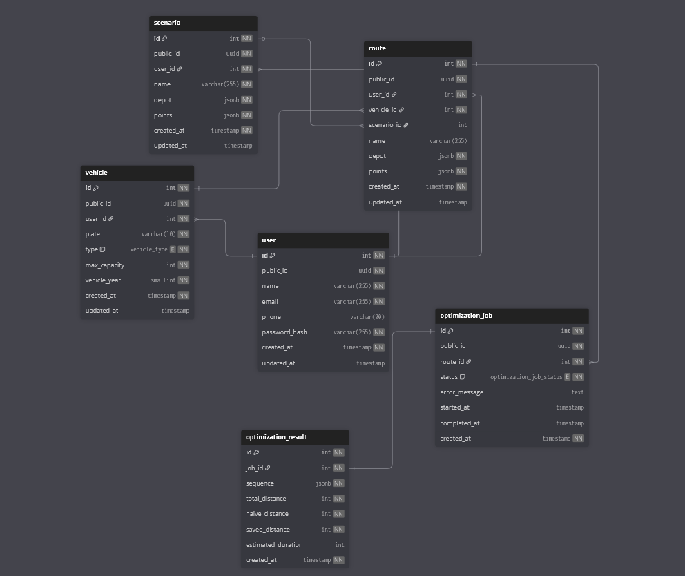

# Database

This document describes the data model of WiseRoute — its entities, relationships, and the design decisions behind the schema.

---

## Overview

The schema is organized around three conceptual groups:

**Identity** — who is using the system and what vehicle they operate.
`user` → `vehicle`

**Routing** — the input the user provides and the optional scenario template it may originate from.
`scenario` → `route`

**Optimization** — the asynchronous execution lifecycle and its result.
`route` → `optimization_job` → `optimization_result`

---

## Diagram



---

## Entities

### `user`

Represents a registered account. Passwords are never stored in plain text — only the bcrypt hash. The `public_id` is the only identifier exposed through the API; the internal `id` is never returned to the client.

### `vehicle`

A vehicle owned by a user. The `max_capacity` field represents the maximum load the vehicle can carry, expressed in kilograms. This value is the core constraint passed to the VRP solver during optimization. The `type` enum (`CAR`, `MOTORCYCLE`, `TRUCK`) is informational in v1 but can drive solver configuration in future versions.

### `scenario`

A reusable input template. Stores a named set of delivery points and a depot so the user can reload a common configuration without re-entering all points for each new route. Scenarios have no result attached — they are input only.

### `route`

The central entity of the domain. Captures everything the user defines before optimization: the depot (starting and return point), the list of delivery points with their cargo weights, and the vehicle to be used. Optionally linked to a `scenario` if the route was created from a saved template.

`depot` and `points` are stored as JSONB:

```json
// depot
{ "name": "Depósito Central", "lat": -3.71, "lng": -38.54 }

// points
[
  { "name": "Cliente A", "lat": -3.73, "lng": -38.52, "cargo_weight": 30 },
  { "name": "Cliente B", "lat": -3.75, "lng": -38.50, "cargo_weight": 20 }
]
```

### `optimization_job`

Tracks the asynchronous execution lifecycle of a route optimization request. Created as `PENDING` when the user submits the request, updated to `PROCESSING` when the optimizer picks it up from RabbitMQ, and finalized as `COMPLETED` or `FAILED`. The `public_id` of this table is the `jobId` returned to the frontend and used to open the SSE stream.

**Status lifecycle:**

```text
PENDING → PROCESSING → COMPLETED
                     → FAILED
```

When the job fails, `error_message` records the reason. No `optimization_result` row is created for failed jobs — its absence is the signal of failure.

### `optimization_result`

Created only when an `optimization_job` reaches `COMPLETED` status. Stores the full output of the OR-Tools solver: the optimal visit sequence with accumulated load per stop, total distance, naive distance (order of input), and the distance saved by the optimization.

`sequence` is stored as JSONB, where each element represents one stop in the optimal route:

```json
[
  {
    "sequence": 1,
    "name": "Depósito",
    "lat": -3.71,
    "lng": -38.54,
    "accumulated_load": 0
  },
  {
    "sequence": 2,
    "name": "Cliente A",
    "lat": -3.73,
    "lng": -38.52,
    "accumulated_load": 30
  },
  {
    "sequence": 3,
    "name": "Cliente B",
    "lat": -3.75,
    "lng": -38.5,
    "accumulated_load": 50
  },
  {
    "sequence": 4,
    "name": "Depósito",
    "lat": -3.71,
    "lng": -38.54,
    "accumulated_load": 50
  }
]
```

---

## Relationships

| Table              | Relation    | Table                 |
| ------------------ | ----------- | --------------------- |
| `user`             | one-to-many | `vehicle`             |
| `user`             | one-to-many | `route`               |
| `user`             | one-to-many | `scenario`            |
| `scenario`         | one-to-many | `route`               |
| `vehicle`          | one-to-many | `route`               |
| `route`            | one-to-many | `optimization_job`    |
| `optimization_job` | one-to-one  | `optimization_result` |

---

## Design Decisions

### Internal `id` vs external `public_id`

Every table uses an auto-increment `int` as the internal primary key for efficient joins and indexing. A `uuid` column (`public_id`) is generated for every record and used exclusively in API responses and URL parameters. Sequential integer IDs are never exposed to the client — doing so would reveal record volume and enable enumeration attacks.

### Why `optimization_job` and `optimization_result` are separate tables

The optimization flow is asynchronous. The job record is created the moment the user submits the request — before any processing begins. The result record is only created after the solver finishes successfully. Separating the two tables reflects this lifecycle: the job always exists, the result may not. This also makes it straightforward to query pending or failed jobs without filtering against null result columns.

### Why `depot` is a separate field from `points`

The depot has fundamentally different semantics from delivery points: it carries no cargo weight, it is always the starting and return node, and the OR-Tools solver requires it to be identified explicitly as node zero in the distance matrix. Keeping it separate avoids filtering logic (`is_depot: true`) throughout the codebase and makes the solver integration cleaner.

### Why JSONB for `points`, `depot`, and `sequence`

Delivery points and route sequences are always read and written as complete arrays — the system never queries individual points in isolation across routes. JSONB avoids an unnecessary join table (`route_point`) without sacrificing any query requirement defined in the functional requirements. Individual point data is accessed by deserializing the array in application code, not via SQL predicates.

### Why `optimization_result` has no error field

A result row is only created on success. Errors are recorded in `optimization_job.error_message`. This makes the invariant explicit: the presence of a result row means success; its absence means the job is still running or has failed. The application layer checks `optimization_job.status` before attempting to fetch the result.

---
