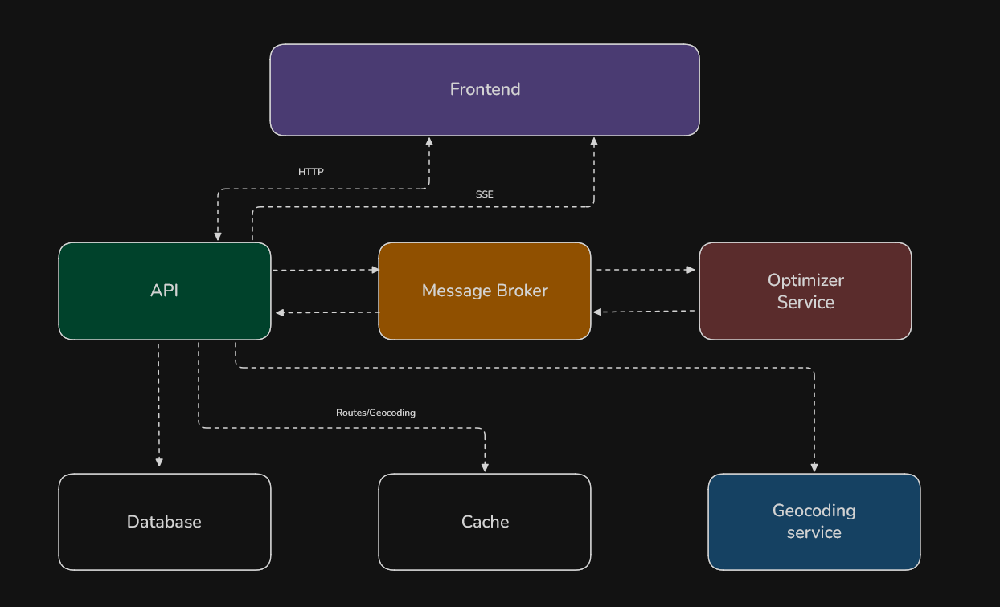

# System Design

## Overview

Wise Route is a route optimization platform designed to assist delivery planning by computing efficient routes based on multiple constraints such as vehicle capacity and delivery point characteristics.

The system allows users to define a starting location, register delivery points with associated metadata (e.g., address and load), and generate an optimized route that minimizes total travel distance while respecting operational constraints. In addition to route computation, the platform provides visualization, execution metrics, and historical tracking of optimization runs.

At a high level, the system is composed of an API layer responsible for handling user interactions, an optimization engine responsible for solving the routing problem, and supporting infrastructure for messaging, persistence, and external services such as geocoding. The optimization workflow is processed asynchronously to accommodate computational cost and scalability requirements.

## Requirements

The system requirements (functional and non-functional) are defined in the following document:

[Requirements](./requirements.md)

## Architecture

### Architecture Overview

The system follows a distributed, event-driven architecture in which computationally intensive route optimization tasks are processed asynchronously. This design decouples request handling from execution, allowing the system to remain responsive under load while supporting scalability and fault isolation.

The API layer handles synchronous client interactions, while optimization workloads are offloaded to a dedicated service via a message broker. Supporting components such as persistence, caching, and external geocoding services provide durability and performance optimizations across the system.

The following diagram illustrates the main components and their interactions.

### Components

Core components:

- Frontend: Provides the user interface for route configuration, execution, and visualization.
- API: Entry point responsible for handling client requests, performing validation, and orchestrating interactions with internal services.
- Message Broker: Messaging infrastructure that enables asynchronous and decoupled communication between services.
- Optimizer Service: Asynchronous worker responsible for executing route optimization algorithms.
- Geocoding Service: External dependency used to resolve addresses into geographic coordinates.
- Database: Persistent storage for domain data, including users, vehicles, delivery points, routes, and execution history.
- Cache Layer: Stores frequently accessed or computationally expensive data to reduce latency.

  
<strong>Component Deep Dive</strong>

#### Frontend

- Responsibility:
  - Provides the interface for user and vehicle stores, route configuration, execution and visualization.
- Key Interactions:
  - Communicates with the API via HTTP and SSE.
- Design Considerations:
  - Receives optimization results streamed from the API via SSE.

#### API

- Responsibility:
  - Acts as the system gateway, handling client requests, performing validation and orchestrating downstream interactions.
- Key Interactions:
  - Communicates with the Frontend via HTTP and SSE.
  - Publishes optimization jobs to the Message Broker.
  - Retrieves and persists data in the Database.
  - Interacts with Cache for performance optimization.
  - Resolves missing geolocation data by calling the Geocoding Service.
- Design Considerations:
  - Generates a deterministic cache key based on input parameters (starting point, delivery points, vehicle constraints).
  - Acts as both message producer and consumer, simplifying orchestration at the cost of increased responsibility.
  - Checks the Cache Layer before proceeding with the optimization pipeline.

#### Message Broker

- Responsibility:
  - Enables asynchronous communication between the API and the Optimizer Service.
- Key Interactions:
  - Receives optimization jobs published by the API.
  - Delivers jobs to the Optimizer Service.
  - Receives results published by the Optimizer Service.
  - Delivers results to the API.
- Design Considerations:
  - Decouples request handling from execution, allowing the system to remain responsive under load.

#### Optimizer Service

- Responsibility:
  - Processes route optimization jobs asynchronously using domain-specific algorithms.
- Key Interactions:
  - Consumes jobs from the Message Broker.
  - Publishes results back to the system via the Message Broker.
- Design Considerations:
  - Stateless processing (does not persist domain data).
  - Designed for horizontal scaling via multiple workers.

#### Geocoding Service

- Responsibility:
  - Resolves addresses into geographic coordinates required for routing.
- Key Interactions:
  - Called by the API to resolve missing geolocation data.
- Design Considerations:
  - External dependency.

#### Database

- Responsibility:
  - Stores persistent data such as users, vehicles, delivery points, routes, and execution history.
- Key Interactions:
  - API retrieves and persists data.
  - API persists optimization results after receiving them from the Optimizer Service
- Design Considerations:
  - Holds domain data owned by the API: Users, Vehicles, Delivery Points, Route metadata.

#### Cache Layer

- Responsibility:
  - Reduces latency by caching frequently accessed or computationally expensive data.
- Key Interactions:
  - API checks for previously computed results using a deterministic cache key.
  - API updates the cache with computed results after optimization.
- Design Considerations:
  - Cache key must uniquely represent optimization inputs.
  - Cache hit bypasses the optimization pipeline, returning the result immediately to the client.

### Data Ownership

- API (Source of Truth)
  - Owns all domain data, including Users, Vehicles, Delivery Points, and Route metadata. Responsible for persistence, consistency, and data lifecycle management.
- Optimizer Service
  - Stateless compute component. Does not persist or own domain data; operates only on data provided through jobs and external reads.
- Database (Source of Truth Storage)
  - Primary persistence layer for all domain entities. Ensures durability and consistency of system state.
- Cache Layer (Derived Data)
  - Stores derived and ephemeral data, such as computed routes and geocoding results, to improve performance. Not a source of truth and can be invalidated or rebuilt.
- Message Broker (Transient Data)
  - Holds messages temporarily for asynchronous processing. Does not own data and provides no long-term persistence guarantees.
- Geocoding Service (External Ownership)
  - External system responsible for address resolution. Data ownership lies outside the system boundary.

### Optimization Flow

This flow follows an async request–reply pattern using a message broker, with the API acting as both producer and consumer.

1. The user submits a route optimization request via the Frontend.
2. The API validates the request and normalizes input data.
3. A deterministic cache key is generated based on the input parameters (starting point, delivery points, and vehicle constraints).
4. The API checks the Cache Layer for a previously computed result.
5. If a cache hit occurs, the cached result is returned immediately to the client, bypassing the optimization pipeline.
6. If no cache entry is found, the API proceeds with request processing.
7. Missing geolocation data is resolved via the Geocoding Service (if required).
8. The API persists initial route metadata and publishes an optimization job to the Message Broker.
9. The Optimizer Service consumes the job and processes the route asynchronously.
10. Upon completion, the Optimizer Service publishes the result to the Message Broker.
11. The API, acting as a message consumer, receives the result, persists it in the Database, and updates the Cache Layer.
12. The API streams the final result to the client via SSE.
